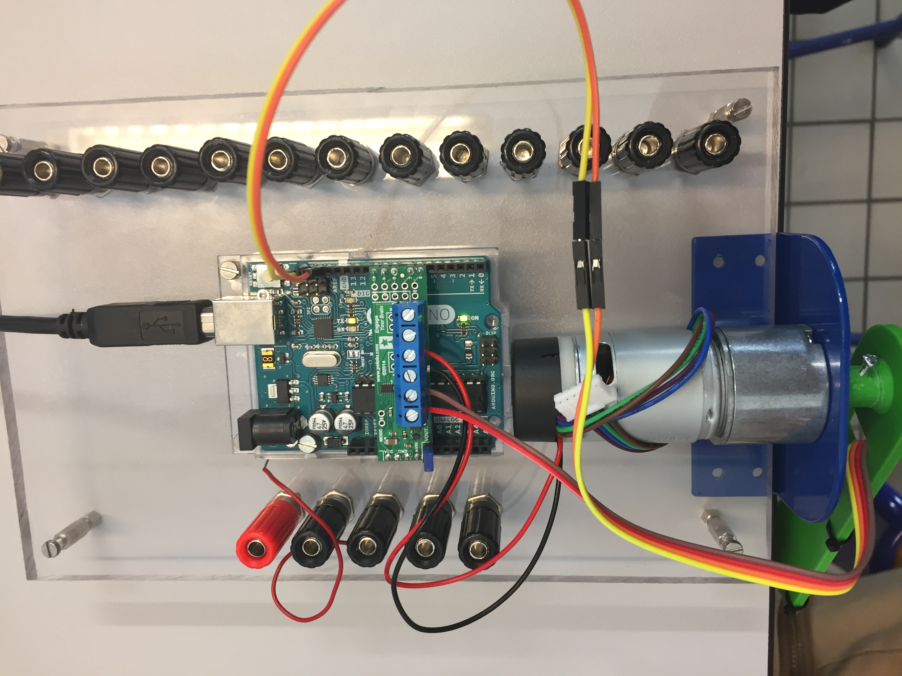
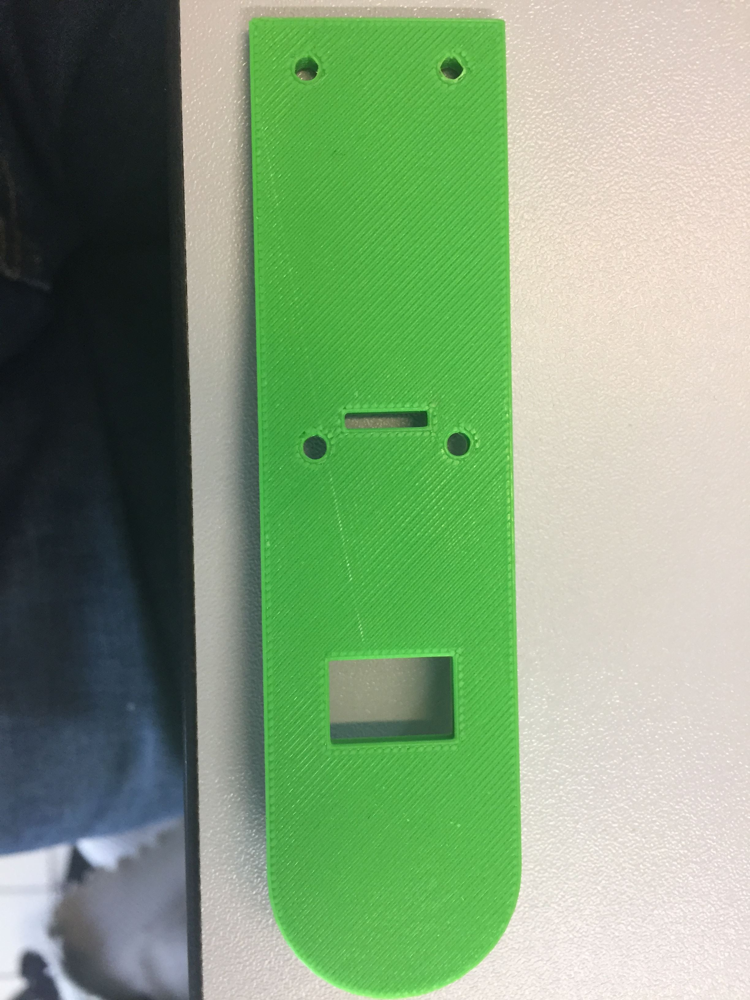
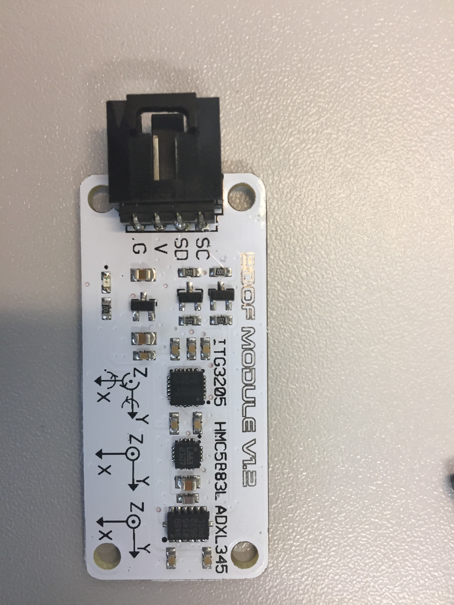
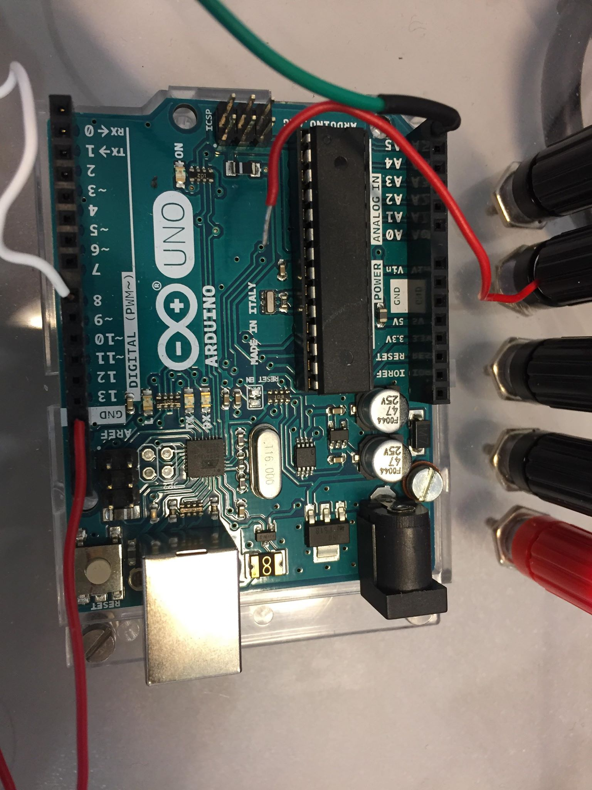
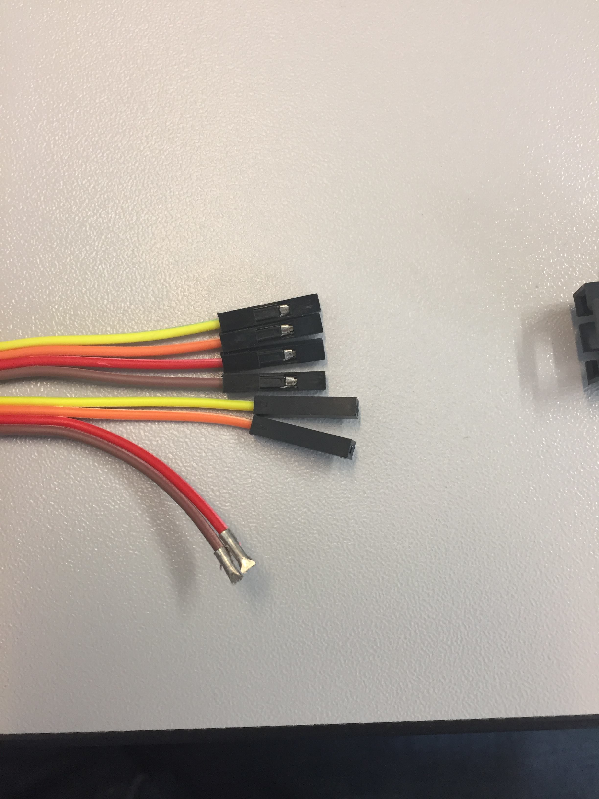
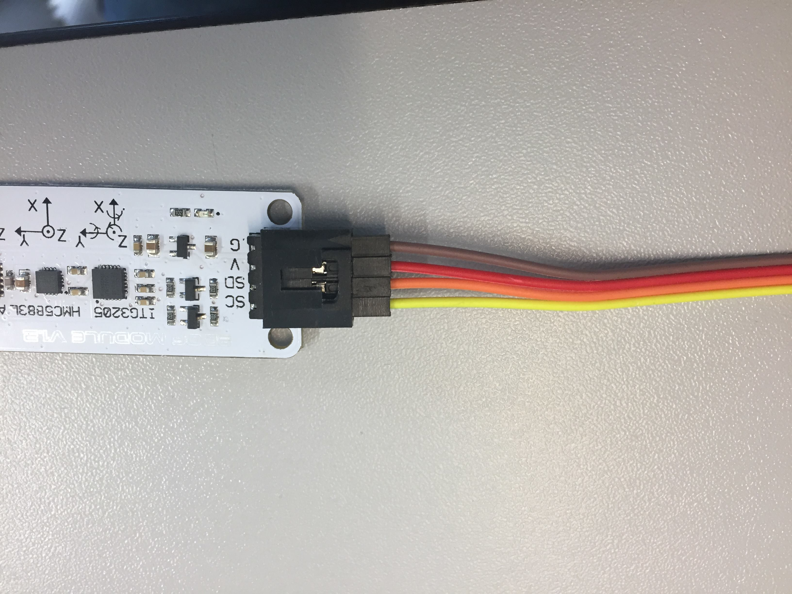
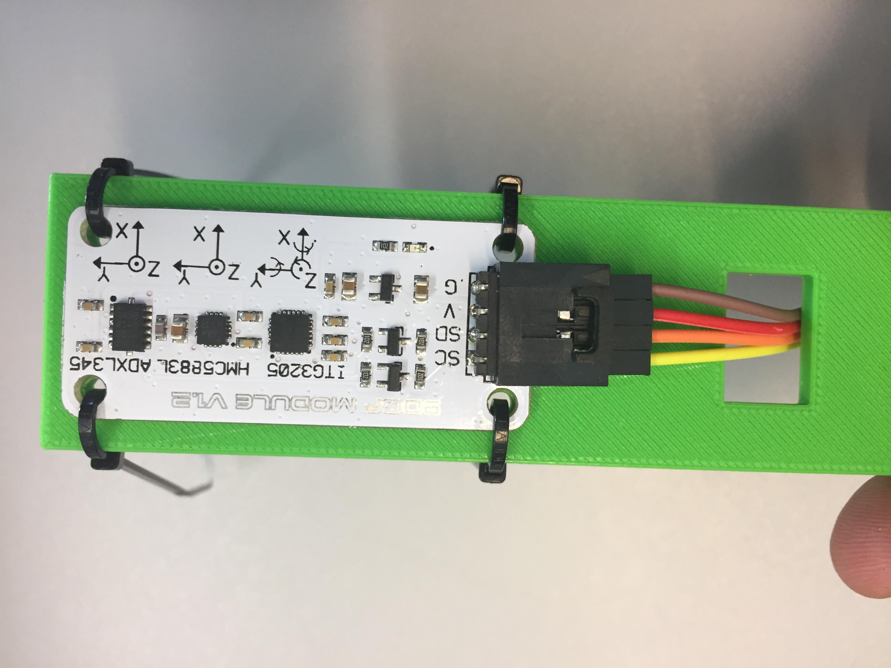
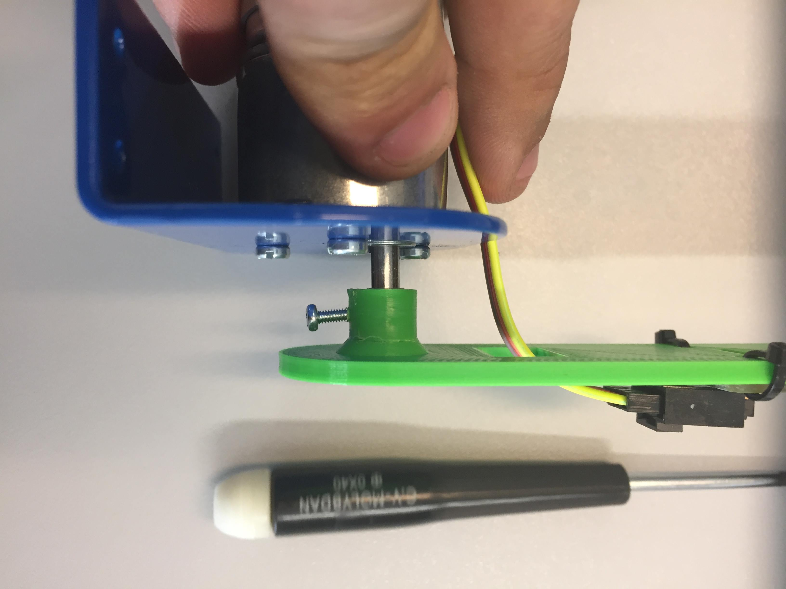
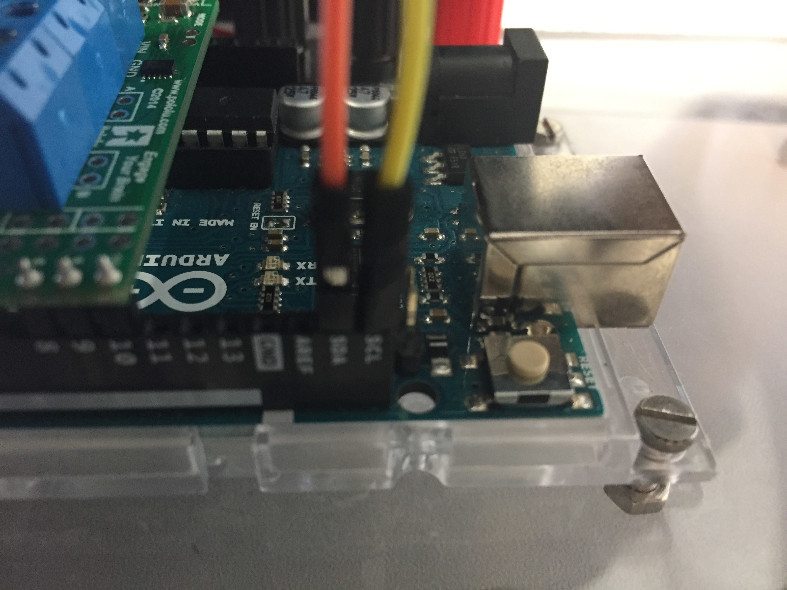

# assembly compass

## Summary
1. Hardware
2. Process
3. Result

## 1) Hardware
- motor drive (if you dont have this assembly refer to assembly motor driver.md in: ..\docs\procedure\assembly motor driver)

- green support with his M2*1 x1

-  Octopus 9DOF module

-  arduino uno

-  some dupon f/m cable

-  4 ziptie

## 2) Process 
- connect put conector on octopus module (yellow scl, orange sda, red vin, brown ground)

- tie the module on the green support with ziptie ( put the cable in the hole)

- connect the green suport to the motor assembly with the m2 screw (be sure to put the screw on the flat side the motor axis)

- connect the power of octopus module to the motor driver (red vin, brown ground)

- connect the sda and scl to arduino (yellow scl, orange sda)

## 3) Result 

- This is how the final assembly looks like

