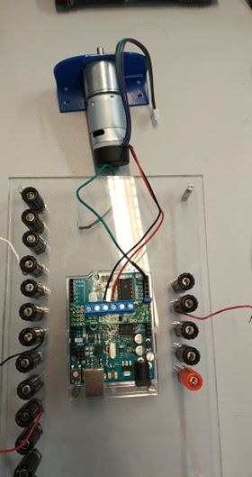

# Correction
* Put **/procedures** folder in **/docs**.
* On the other one you have a */picture* folder... choose one way to do it, but do the same everywhere.

# Assemassembly procedure to mount the motor driver on the Arduino and connect the motor

## Summary
1. Hardware
2. Process
3. Arduino
4. result

## 1) Hardware
1. [Arduino Uno](https://store.arduino.cc/) 

2. Motor assembly: [EMG30](https://www.gotronic.fr/art-motoreducteur-encodeur-emg30-866.htm) 

3. Motor driver: [Pololu DRV8835 Dual Motor Driver Shield for Arduino](https://www.pololu.com/product/2511) 

## 2) Process
- The motor driver must be plugged into the Arduino.
- On one of the sides, we can see *[10 9 8 7 6]* and on the opposite side, we can see *[VCC GND AVIN]*.
- And on the Arduino, we can see the pins [10 9 8 7 6 ].
- Plug the side with the pins *[10 9 8 7 6]* of the motor driver on the same pins of the Arduino.
**Check the opposite side.**
- Now we have to plug the red and black wires of the motor in the driver motor in the pins *[M1A M1B]*.

A picture would improve readability.

## 3) Arduino
- Connect the arduino to laptop via usb type-B cable
- Open the arduino IDE software (version 1.8 or higher)
- In the Arduino IDE, open the "Sketch" menu, select "Include Library", then "Manage Libraries..
- Search for "DRV8835MotorShield".
- Click the DRV8835MotorShield entry in the list.
- Click "Install".

## 4) Result
This is how the final assembly looks like

