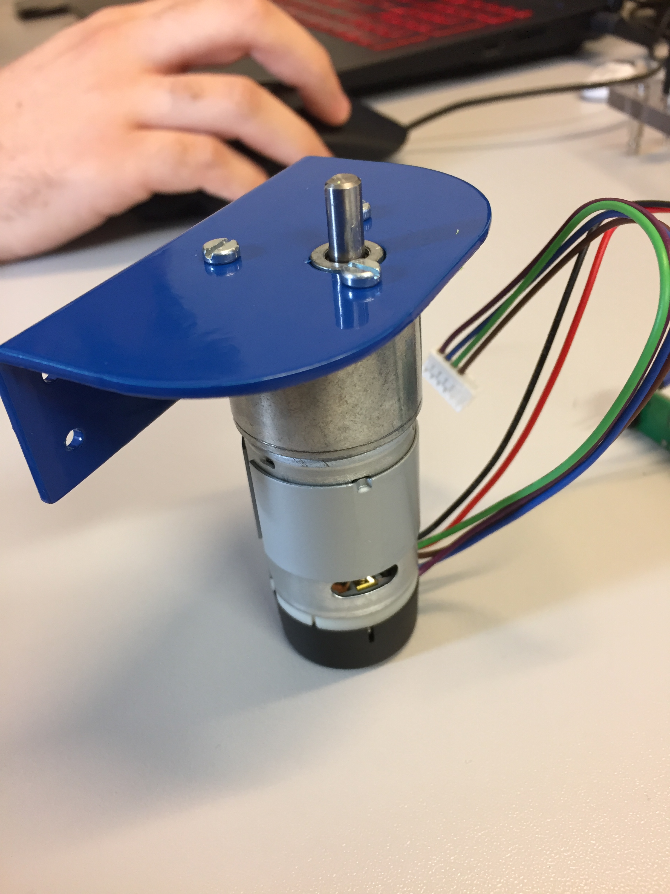
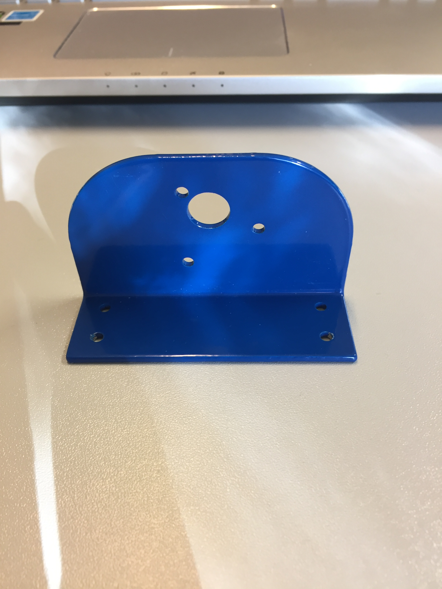
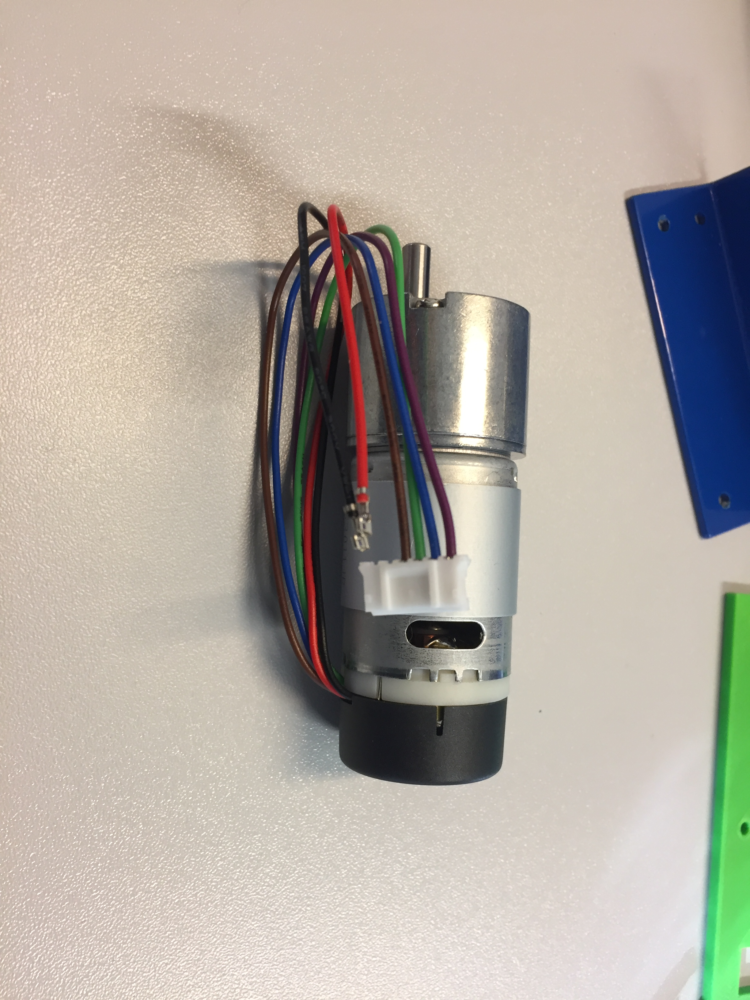
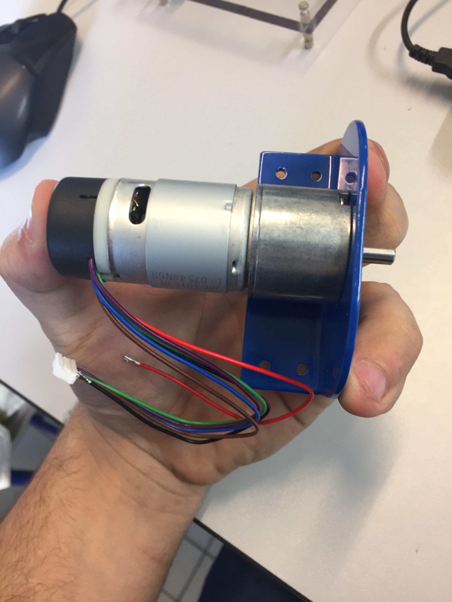
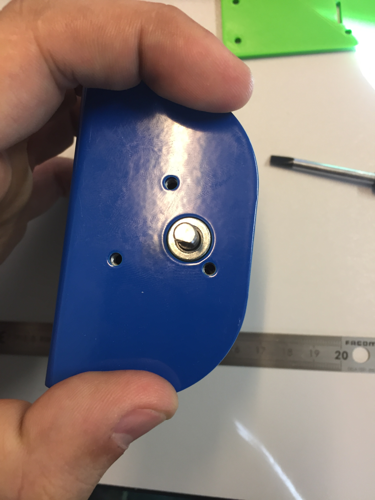
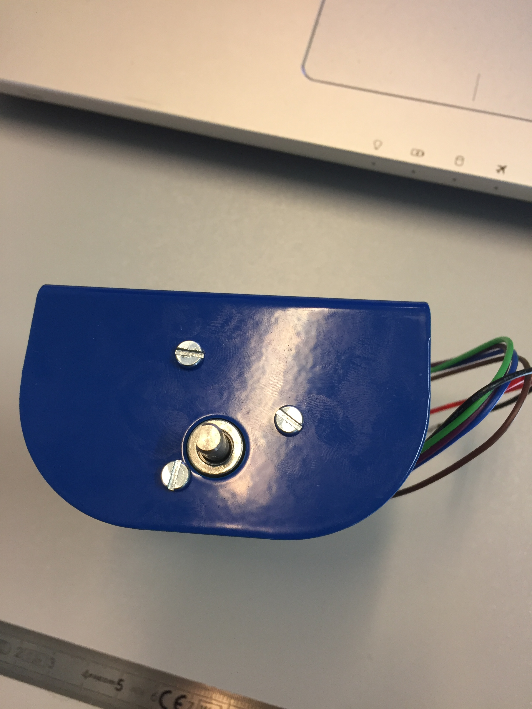

# Correction
* Put **/procedures** folder in **/docs**.
* A title is missing.

# context

this document is a procedure for the motor assembly

## Summary
1. Hardware
2. process
3. result

## 1) Hardware
- motor support

- motor EMG30

- m3*6 screw x3 

## 2) Process 
- put together the motor support and the motor

- turn the motor in the support for aline holes

- take the m3 screws and screw the support to the motor

## 3) Result 

- This is how the final assembly looks like

