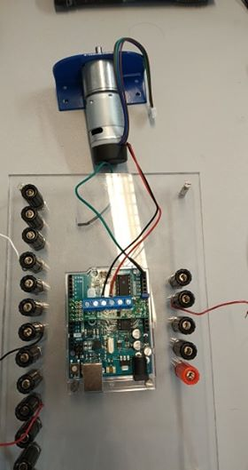

# Assemassembly procedure to mount the motor driver on the Arduino and connect the motor

## Summary
1. Hardware
2. process
3. result

## 1) Hardware
1. [Arduino Uno](https://store.arduino.cc/) 

2. Motor: [EMG30](https://www.gotronic.fr/art-motoreducteur-encodeur-emg30-866.htm) 

3. Motor driver: [Pololu DRV8835 Dual Motor Driver Shield for Arduino](https://www.pololu.com/product/2511) 

## 2) Process
- The motor driver must be plugged into the Arduino.
- On one of the sides, we can see *[10 9 8 7 6]* and on the opposite side, we can see *[VCC GND AVIN]*.
- And on the Arduino, we can see the pins [10 9 8 7 6 ].
- Plug the side with the pins *[10 9 8 7 6]* of the motor driver on the same pins of the Arduino.
**Check the opposite side.**
- Now we have to plug the red and black wires in the driver motor in the pins *[M1A M1B]*.

## 3) Result
this how is the final assembly 
