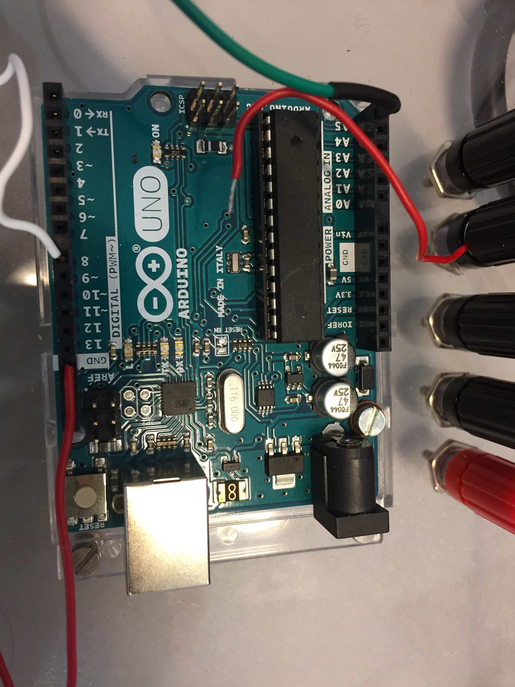

# Assemassembly procedure to mount the motor driver on the Arduino and connect the motor

## Summary
1. Hardware
2. process
3. result

## 1) Hardware
1. [Arduino Uno](https://store.arduino.cc/) 

2. Motor: [EMG30](https://www.gotronic.fr/art-motoreducteur-encodeur-emg30-866.htm) 

3. Motor driver: [Pololu DRV8835 Dual Motor Driver Shield for Arduino](https://www.pololu.com/product/2511) 

## 2) Process
### step 1
The motor driver must be plugged into the arduino, and for this, 
