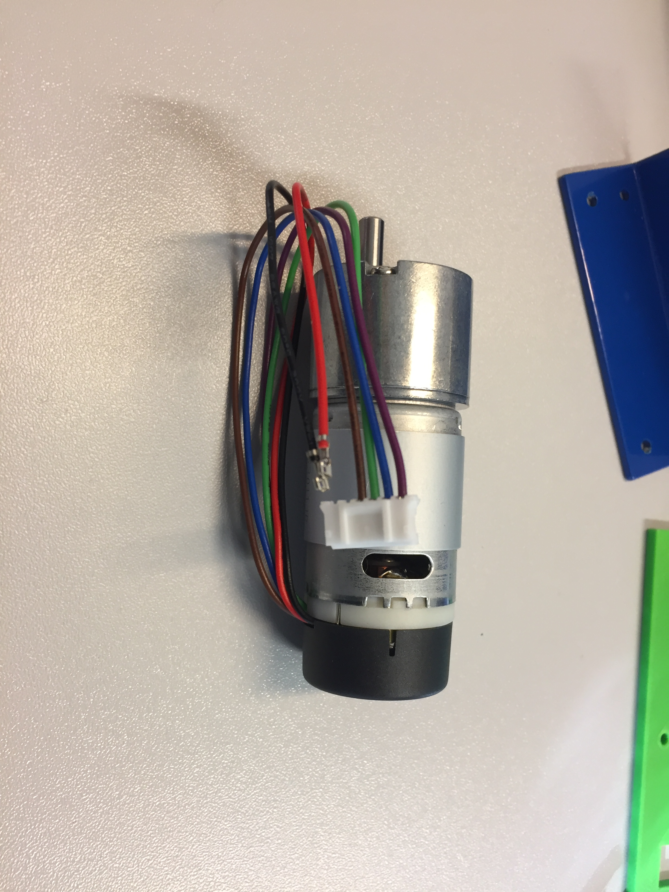
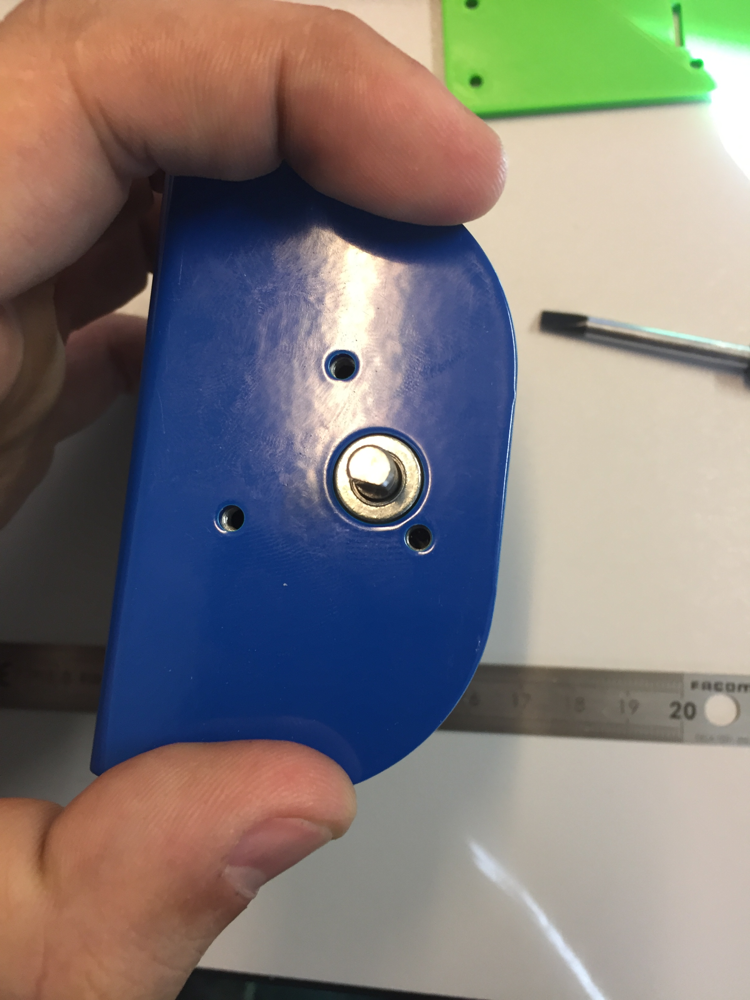

# context

this document is a procedure for the motor assembly

## Summary
1. Hardware
2. process
3. result

## 1) Hardware
motor support

motor EMG30

m3*6 screw

## 2) Hardware
put together the motor support and the motor

turn the motor in the support for aline holl

take the m3 screw and screw the support to the motor

## 3) result

this how is the final assembly

